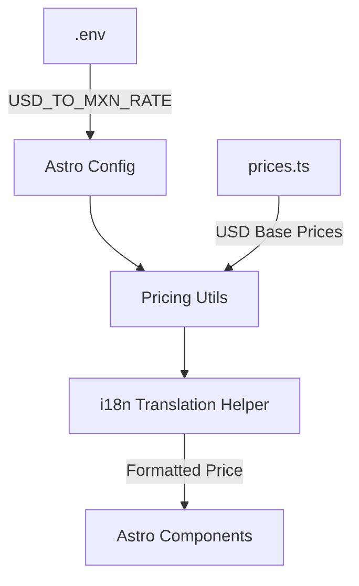

# Design: Global Pricing System

## Architecture



### 1. Data Structure (`src/data/prices.ts`)
We will organize prices by destination and tier. This file will be the "Single Source of Truth".

```typescript
export const BASE_PRICES = {
  cancunZone: {
    private: { ow: 29.99, rt: 59.99 },
    luxury: { ow: 84.00, rt: 160.00 },
    group: { ow: 84.00, rt: 160.00 },
  },
  // ... all other destinations
} as const;
```

### 2. Pricing Engine
A utility function will handle the conversion:

```typescript
function formatPrice(usdPrice: number, lang: 'en' | 'es') {
  if (lang === 'es') {
    const rate = Number(import.meta.env.USD_TO_MXN_RATE || 18.0);
    const mxn = usdPrice * rate;
    return `$${mxn.toLocaleString('es-MX', { minimumFractionDigits: 2 })} MXN`;
  }
  return `$${usdPrice.toFixed(2)} USD`;
}
```

### 3. Integration with i18n
The `useTranslations` hook will be enhanced to detect price keys or allow passing price variables.

### 4. Component Refactoring
- **RatesTable**: Instead of iterating over `global.ratesTable.destinations` from JSON (which contains strings), it will iterate over `BASE_PRICES` and use the utility to format values.
- **PricingSection**: Page-specific pricing cards will reference `BASE_PRICES[pageKey]`.
